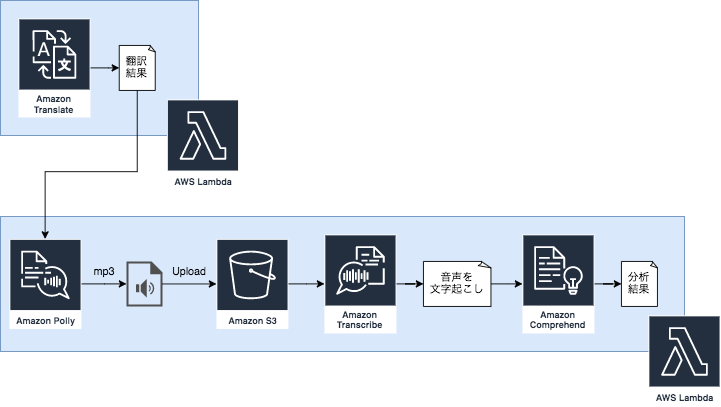

# aws-sam-polly-transcribe-comprehend

## 構成



### TranslateFunction
1. 英語文章でリクエストされたparams['text']を日本語文章に変換して出力(Translate)

### ComprehendFunction
1. リクエストされたparams['text']を読み上げてmp3ファイルを生成 (**Polly**)
2. 作成したmp3をS3にアップロード (S3)
3. S3のmp3ファイルを文字起こし (**Transcribe**)  
※ params['text']と同じ値が生成される予定
4. 文字起こししたJSONファイルを言語分析して結果を出力 (**Comprehend**)

## 実行手順
- Cloud9上で実行できることは確認できています。
- Cloud9で[本リポジトリ](https://github.com/gitkado/aws-sam-polly-transcribe-comprehend)をcloneして使用してください。
  - template.yamlの7行目に作成するS3バケット名を入力して使用してください。

```sh
# 関数実行
$ sam local invoke TranslateFunction --event events/us_event.json
$ sam local invoke ComprehendFunction --event events/ja_event.json

# APIサーバ起動(http://127.0.0.1:3000/)
$ sam local start-api

# sam package
$ sam package \
    --template-file template.yaml \
    --s3-bucket 作成済みの自由なバケット名 \
    --output-template-file packaged-template.yaml \
    --region ap-northeast-1
# sam deploy
$ sam deploy \
    --template-file packaged-template.yaml \
    --stack-name cfn-aws-sam-polly-transcribe-comprehend \
    --capabilities CAPABILITY_IAM
```

## 参考
https://github.com/harunobukameda/Amazon-Translate---Amazon-Polly---Amazon-Transcribe---Amazon-Comprehend---Amazon-Elasticsearch
